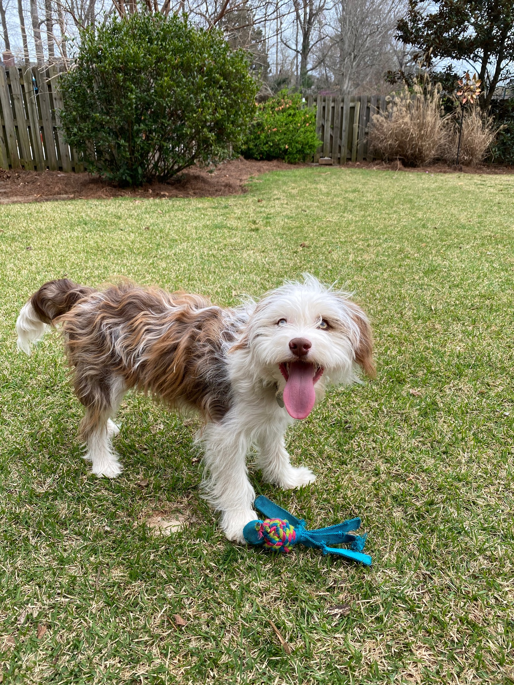

```{=html}
<style type="text/css">
.title {
  display: none;
}

#getting-started img {
  margin-right: 10px;
}

</style>
```
<div class="row" style="padding-top: 30px;">

::: col-sm-6
# **Emmylou**

Emmylou is a Mini Aussiedoodle born in Bremen, GA. She was born on September 21st, 2020. Emmylou is on the smaller side for minis weighting roughly 30 pounds. Since Emmy is a mix between a Poodle and an Australian Shepherd, she is very smart and athletic. She learns new tricks quickly. She loves her people hard and likes to be by their side 24/7. Emmylou is an absolute sweetheart.

## Emmylou's Favorite Activities

1.  Saturday walks to the dog park

2.  Catching the ball in the backyard

3.  Cuddling with her people

4.  Trips to the lake


:::

<!-- ::: col-sm-6 -->

```{=html}
<!-- ###  </a>

<!-- <a href = "https://crumplab.github.io">  </a> -->
```
<!-- ::: -->
