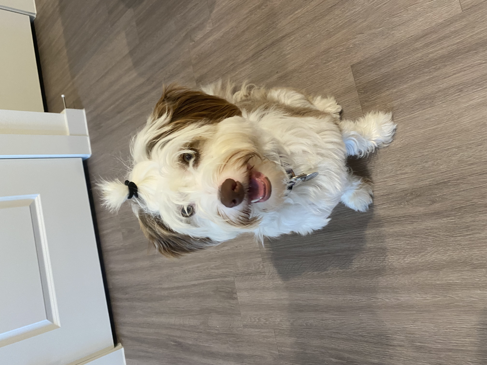
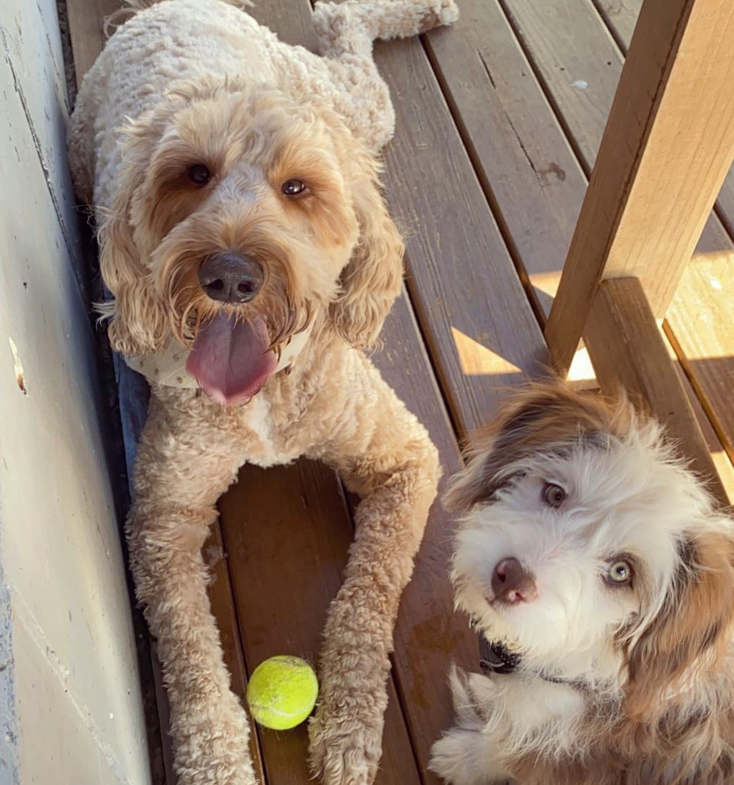
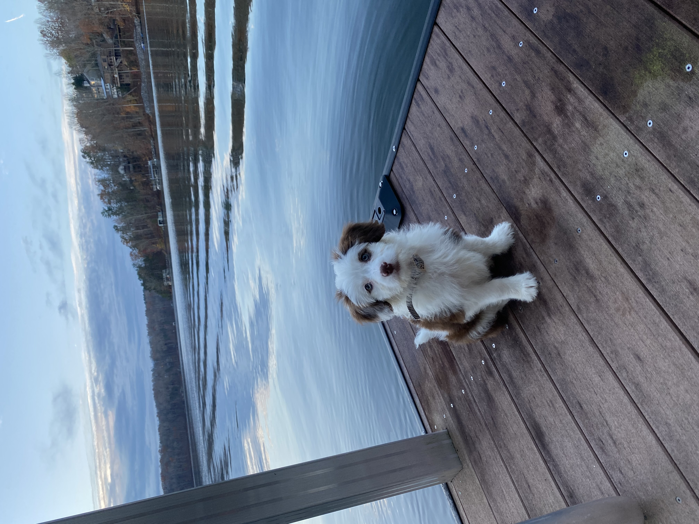
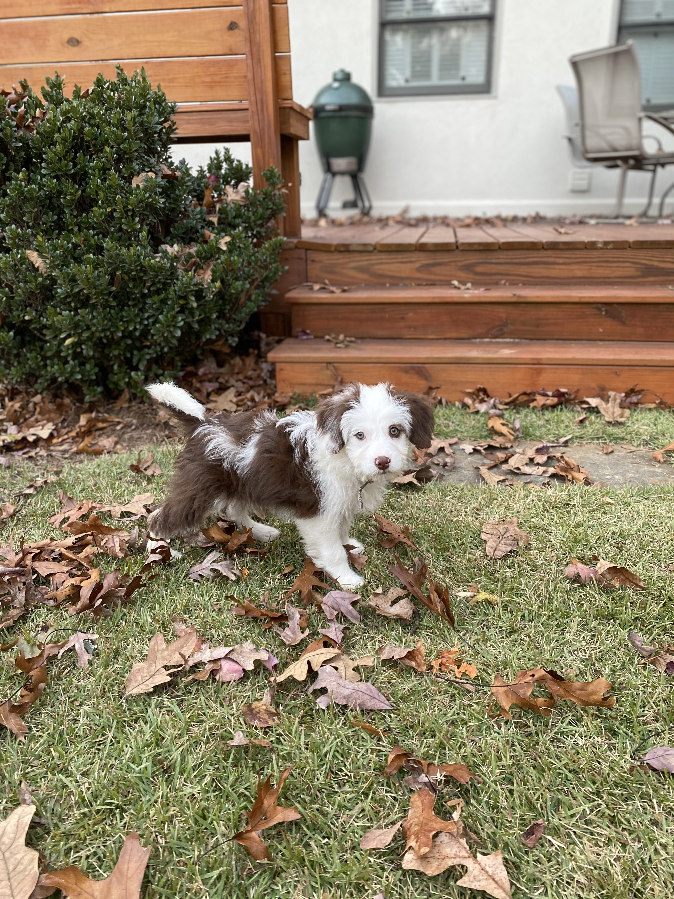
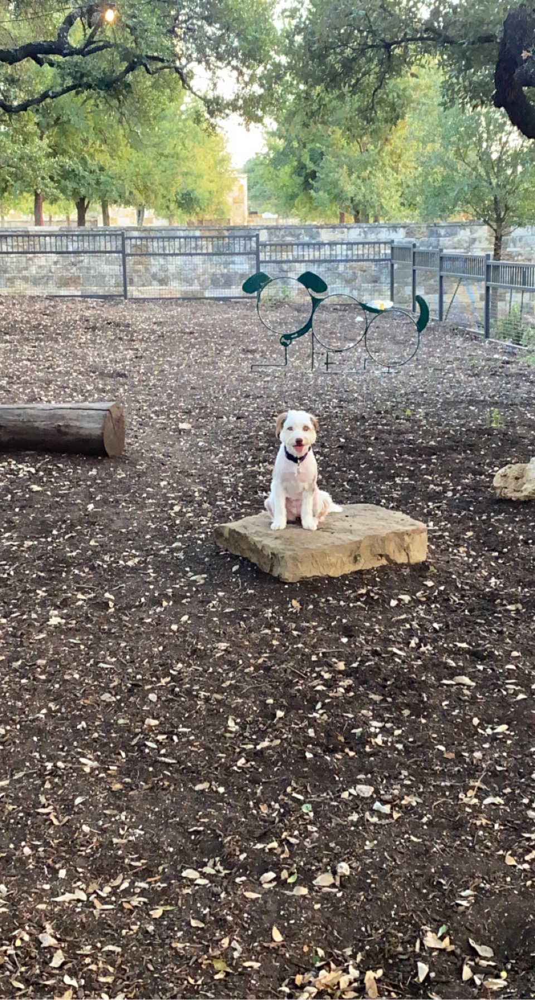
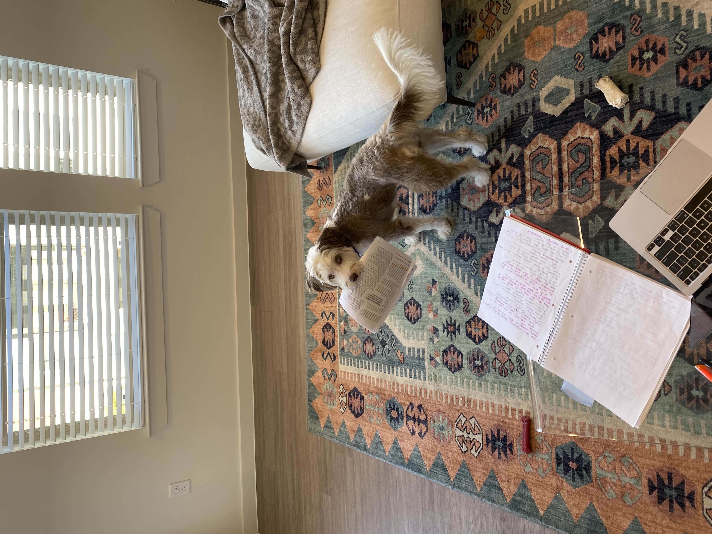

When the bangs get too long, party pony time!
</a>

Luna and Emmylou at Fetch in Atlanta, GA.
</a>

Emmylou's first time at the lake
</a>

Emmylou as a puppy
</a>

Fresh Cut
</a>

Emmy LOVES helping with homework!
</a>

Hiking
</a>

Emmylou is always a happy girl when she's running
</a>

<!--  -->

<!-- 
 -->

<!-- 
 -->

<!-- # **Emmylou** -->

<!-- Here is where I will put pictures if I learn that step -->

<!-- 
 -->

<!-- 
 -->

<!-- </a> -->

<!-- 
 -->
