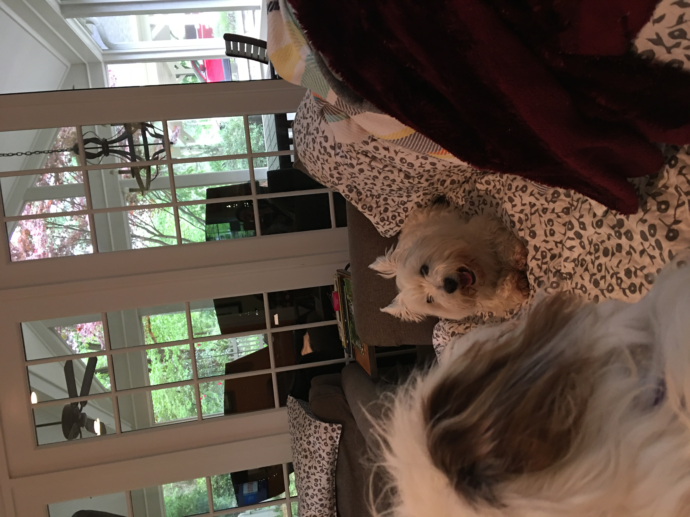
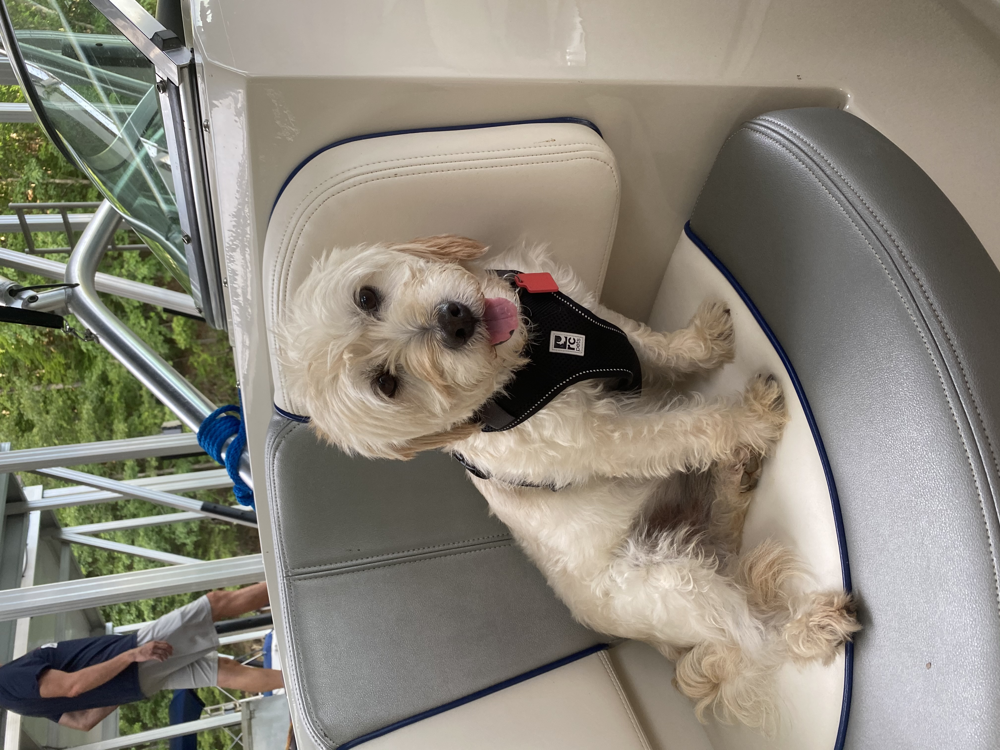

# 

Emmylou has never met a stranger. She gets along with dogs of all sizes. Since she is a puppy, we joke that she is that annoying little sibling that always wants to play with the big kids.

With that being said, Emmylou has a few best pup pals.

1. Luna Tuna - Luna and Emmylou's moms are bffs. Luna is pony-sized coming in at 70 pounds. She is a 4-year-old goldendoodle that loves tennis balls. She honestly could care less about Emmylou, but Emmylou loves her. Luna loves going on walks with her mom and slow dancing with her front paws on her human's shoulders. 

</a>

2. Maggie - Maggie and Emmylou are cousins. She is a 10-year-old White Westie. Maggie was one of Emmylou's first friends and taught Emmylou dog etiquette, meaning she put Emmylou in her place. Sadly, Maggie had to be put down in February because she had cancer. She is missed by the whole family. These two dogs spent holidays, family dinners, and weekends together.

</a>

3. Dobby - Dobby, also know as the pole dog, is Emmylou's long distance pal. Dobby was adopted by Emmylou's Aunt and Uncle in San Antonio, TX and now lives his best life in Hawaii. Hence his nickname, Pole Dog, Dobby was left abandoned on a pole for a long time before finding his forever home. He had quite a few health issues, but is healthy now. Since Emmylou and Dobby have never lived in the same state at the same time, they enjoying seeing each other via FaceTime. No doubt, they will have a grand time when they finally get to meet in person.

</a>

4. Jerry and the Sidekicks - This trio lives in Emmylou's neighborhood. Jerry is not a dog, but he does own two Shetland Sheepdog. They walk around the block every morning at 10 o'clock sharp. They make sure to stop by and say hi to Emmylou. However, Emmylou could care less about the two dogs. She LOVES Jerry. It is the most excited she ever gets and she gets excited often. 

5. Disco - Disco and Emmylou are from the same litter! Disco's mom works with Emmylou's granny and is the reason we got Emmylou. Disco is a bit bigger than Emmylou and a tad bit shy. That doesn't stop these two from playing hard. They are both equally fast and love to play rough and tumble style. 
